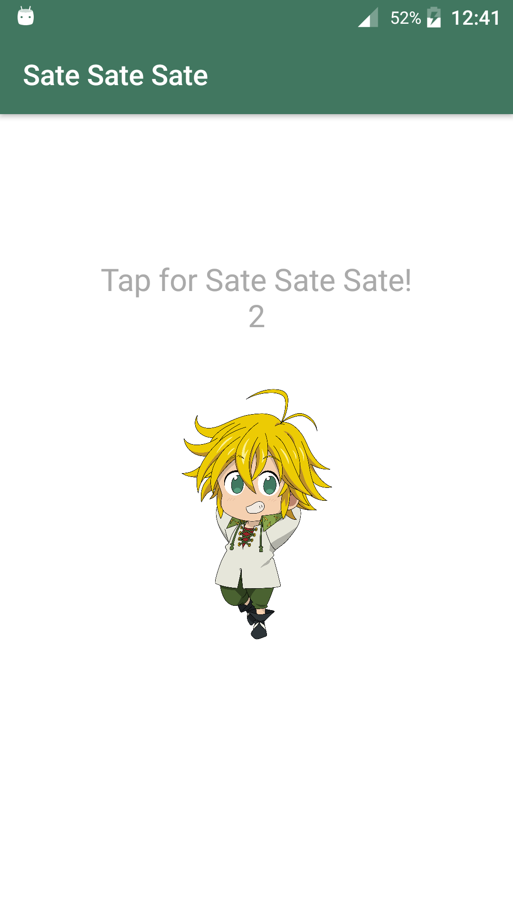
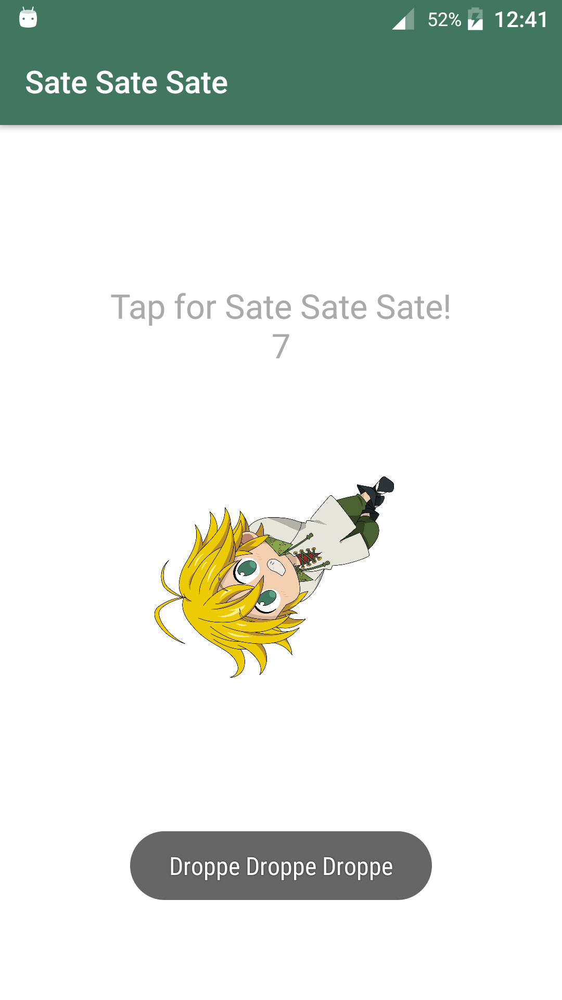
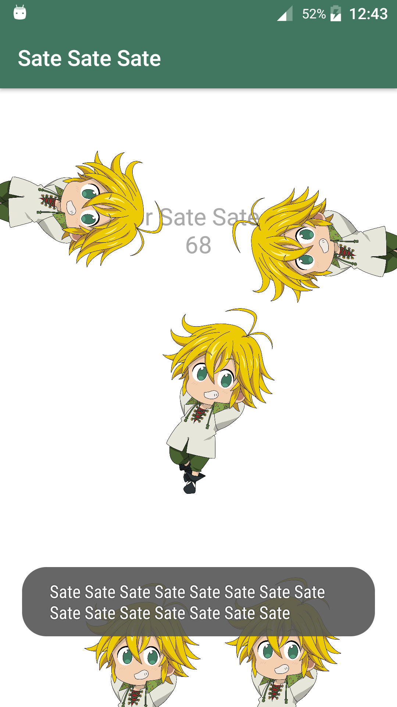

# Sate sate sate
A fun little Android app featuring Meliodas from "The Seven Deadly Sins". Performs various actions when the user taps Meliodas.

### Brief

Inspired by this wonder: [Tuturu](https://play.google.com/store/apps/details?id=com.VizegrafIndie.Tuturu)

Thanks [katelinelaine](https://www.deviantart.com/katelinelaine) for the awesome Meliodas image.

### Screenshot
||||

------

###### Doing my best to use:

- *Semantic versioning: https://semver.org/spec/v2.0.0.html*
- *Clean code*

